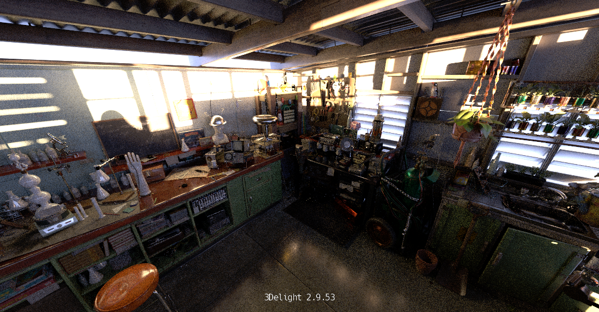
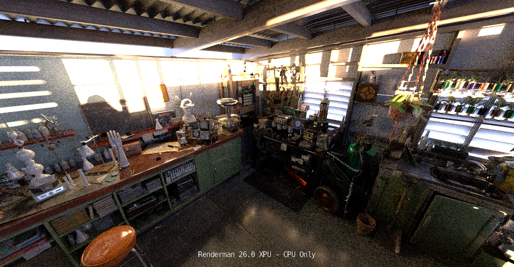

# 3D Renderer Benchmarking - Comparing 3Delight and Renderman

Base scene from https://animallogic.com/alab/

3Delight (v2.9.53)
Shading Samples: 360 (to target the 10 min rendertime, default too low)
Maximum Ray Trace Distance: 2000 (to accommodate the size of the Lab scene)
Pixel Filter/Filter Width: gaussian/1.0 (to match Renderman default)

Renderman (v26.0)
Max Diffuse Depth: 3 (to match 3Delight default)
Pixel Variance: 0.03 (to target the 10 min rendertime)
Min/Max Samples: 256/4096 (the defaults too low)

## Results

